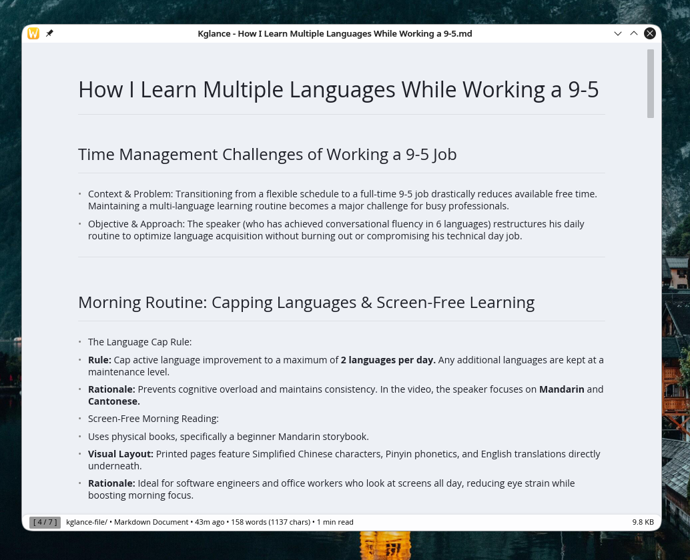

# Kglance (Oxiview)



A high-performance file preview application for **KDE Plasma 6** built in Rust and Iced. Inspired by macOS QuickLook, Kglance provides near-instantaneous file previews via a single keypress.

It operates in two modes:

- **Daemon Mode**: Long-running background service listening on DBus for instant window toggle (<10ms UI latency).
- **Standalone Mode**: Opens directly for previewing a file without requiring the daemon process, automatically exiting upon close.

---

## Key Features

- **Source Code & Text**: Syntax highlighting via `syntect` with line numbers, text search (`Ctrl+F`), and word wrap toggle.
- **Images**: Fast rendering of PNG, JPEG, WebP, GIF, BMP, and SVG (`resvg`). Full support for zoom, pan, rotation, and detailed EXIF metadata sidebar.
- **Documents & Office**: PDF continuous scrolling, page navigation, and thumbnail sidebar; text extraction for DOCX & XLSX with LibreOffice fallback; `.typ` document rendering via `typst` CLI (if installed).
- **Archives**: Interactive folder tree view for ZIP, Tar, GZ, and 7z archives with inner file preview.
- **Audio & Video**: Metadata extraction, waveform visualization, and inline media playback using GStreamer pipelines.
- **Fonts**: Font sample rendering (TTF, OTF, WOFF) and metadata display (`fontdue`).
- **KDE Plasma 6 Integration**: Automatic Dark/Light mode theme sync, Dolphin file manager integration (Space key preview via KIO Service Menu), and autostart daemon.

---

## Supported File Formats

| Category         | Formats                                                                                                                                                                                                                                                                                                                                                                                                                                  |
| ---------------- | ---------------------------------------------------------------------------------------------------------------------------------------------------------------------------------------------------------------------------------------------------------------------------------------------------------------------------------------------------------------------------------------------------------------------------------------- |
| **Code**         | `.rs`, `.py`, `.js`, `.ts`, `.jsx`, `.tsx`, `.html`, `.css`, `.scss`, `.json`, `.toml`, `.yml/.yaml`, `.xml`, `.sh`, `.bash`, `.zsh`, `.fish`, `.c`, `.h`, `.cpp`, `.hpp`, `.java`, `.kt`, `.swift`, `.go`, `.rb`, `.php`, `.pl`, `.pm`, `.lua`, `.r`, `.sql`, `.graphql`, `.proto`, `.tex`, `.bib`, `.dockerfile`, `.makefile`, `.cmake`, `.gradle`, `.cfg`, `.ini`, `.conf`, `.txt`, `.log`, `.diff`, `.patch`, `.vim`, `.ps1`, `.bat` |
| **Markdown**     | `.md`, `.markdown`, `.mdown`, `.mdwn`, `.mkd`, `.mkdn`                                                                                                                                                                                                                                                                                                                                                                                   |
| **Images**       | `.png`, `.jpg`, `.jpeg`, `.webp`, `.gif`, `.bmp`, `.ico`                                                                                                                                                                                                                                                                                                                                                                                 |
| **Vector**       | `.svg`                                                                                                                                                                                                                                                                                                                                                                                                                                   |
| **Documents**    | `.pdf`, `.epub`, `.typ` (requires `typst`)                                                                                                                                                                                                                                                                                                                                                                                               |
| **Office**       | `.docx`, `.xlsx`, `.pptx`, `.odt`, `.ods`, `.odp`                                                                                                                                                                                                                                                                                                                                                                                        |
| **Spreadsheets** | `.csv`, `.xlsx`, `.ods`                                                                                                                                                                                                                                                                                                                                                                                                                  |
| **Archives**     | `.zip`, `.tar`, `.gz`, `.tgz`, `.xz`, `.txz`, `.7z`                                                                                                                                                                                                                                                                                                                                                                                      |
| **Fonts**        | `.ttf`, `.otf`, `.woff`, `.woff2`                                                                                                                                                                                                                                                                                                                                                                                                        |
| **Audio**        | `.mp3`, `.wav`, `.flac`, `.ogg`, `.aac`, `.m4a`, `.opus`                                                                                                                                                                                                                                                                                                                                                                                 |
| **Video**        | `.mp4`, `.mkv`, `.avi`, `.mov`, `.wmv`, `.webm`, `.flv`, `.m4v`                                                                                                                                                                                                                                                                                                                                                                          |
| **Folders**      | Any directory — browse and navigate its contents                                                                                                                                                                                                                                                                                                                                                                                         |

Files without a matching extension fall back to plain text rendering.

---

## Dependencies

### System Build Dependencies

To build Kglance from source on Linux (Debian/Ubuntu/Arch/Fedora), the following system development libraries are required:

| Component          | Library Dependency                                        | Description / Usage                          |
| ------------------ | --------------------------------------------------------- | -------------------------------------------- |
| **Fonts & Layout** | `libfontconfig1-dev` / `fontconfig`                       | Font matching and fallback configuration     |
| **FreeType**       | `libfreetype6-dev` / `freetype2`                          | Font rendering engine for text/font previews |
| **XKB Common**     | `libxkbcommon-dev` / `libxkbcommon`                       | Keyboard keycode handling for Wayland & X11  |
| **GStreamer**      | `libgstreamer1.0-dev`, `libgstreamer-plugins-base1.0-dev` | Audio and video decoding/playback pipeline   |
| **MuPDF**          | `libmupdf-dev` _(optional system bind)_                   | PDF rendering engine                         |
| **Typst**          | `typst` _(optional CLI binary)_                           | Typst (`.typ`) document compilation & preview|

#### Installing Dependencies

- **Arch Linux:**
  ```bash
  sudo pacman -Syu fontconfig freetype2 libxkbcommon gstreamer gst-plugins-base gst-plugins-good gst-plugins-bad gst-libav gst-plugin-va gst-plugins-ugly
  ```
- **Ubuntu / Debian:**
  ```bash
  sudo apt install libfontconfig1-dev libfreetype-dev libxkbcommon-dev libgstreamer1.0-dev libgstreamer-plugins-base1.0-dev gstreamer1.0-plugins-good gstreamer1.0-plugins-bad
  ```
- **Fedora:**
  ```bash
  sudo dnf install fontconfig-devel freetype-devel libxkbcommon-devel gstreamer1-devel gstreamer1-plugins-base-devel gstreamer1-plugins-good gstreamer1-plugins-bad-free gstreamer1-plugins-bad-free-devel
  ```

---

## Keyboard Shortcuts

Kglance offers rich keyboard navigation for navigating files, zooming images, scrolling PDFs, and searching text.

| Shortcut                      | Action                                         | Scope / Context              |
| ----------------------------- | ---------------------------------------------- | ---------------------------- |
| `Space` / `Escape`            | Close preview window                           | Global                       |
| `Ctrl` + `C`                  | Copy file path / Copy selected text            | Global / Text preview        |
| `Ctrl` + `A`                  | Select all text                                | Text / Code preview          |
| `Ctrl` + `F`                  | Open text search bar                           | Text / Code preview          |
| `Ctrl` + `W`                  | Toggle line word wrap                          | Text / Code preview          |
| `Ctrl` + `+` / `Ctrl` + `=`   | Zoom in / Increase font size                   | Image / PDF / Text preview   |
| `Ctrl` + `-`                  | Zoom out / Decrease font size                  | Image / PDF / Text preview   |
| `Ctrl` + `0`                  | Reset zoom to 100%                             | Image preview                |
| `Shift` + `+` / `Shift` + `=` | Reset font size to 14px                        | Text / Code preview          |
| `Ctrl` + `T`                  | Toggle dark / light theme                      | Global                       |
| `←` / `→`                     | Go to parent dir / Preview selected file       | Folder view                  |
| `Left Arrow` / `PageUp`       | Previous file in directory / Previous PDF page | Directory / Multi-file / PDF |
| `Right Arrow` / `PageDown`    | Next file in directory / Next PDF page         | Directory / Multi-file / PDF |
| `Enter`                       | Preview selected file / Open externally        | Folder view / Global         |
| `Arrow Up` / `k`              | Scroll up                                      | Scrollable content           |
| `Arrow Down` / `j`            | Scroll down                                    | Scrollable content           |
| `PageUp` / `u`                | Scroll half page up                            | Scrollable content           |
| `PageDown` / `d`              | Scroll half page down                          | Scrollable content           |
| `gg` (double-tap `g`)         | Scroll to top                                  | Scrollable content           |
| `G` / `Shift` + `g`           | Scroll to bottom                               | Scrollable content           |
| `Home` (double-tap)           | Scroll to top                                  | Scrollable content           |
| `End`                         | Scroll to bottom                               | Scrollable content           |
| `Mouse Wheel`                 | Scroll / Zoom (with `Ctrl`)                    | All previews                 |

---

## Installation & Setup

### 1. Build from Source

Ensure Rust 1.85+ (Edition 2024) is installed.

```bash
cargo build --release
```

The resulting binary will be at `target/release/kglance`.

### 2. Install Dolphin Integration (KIO Service Menu)

> **Prerequisite**: Ensure `kglance` is in your `PATH` or set `BIN=/path/to/kglance`.

To enable pressing **Space** in Dolphin to preview files, use the setup script:

```bash
# If you have the repo cloned:
./scripts/dolphin-setup.sh install

# Or fetch directly from GitHub:
bash <(curl -s https://raw.githubusercontent.com/Mintori09/kglance/main/scripts/dolphin-setup.sh) install
```

Restart Dolphin (`killall dolphin`) or log out and back in to apply the changes.

### 3. Configure Dolphin Keyboard Shortcut

To preview files by pressing **Space**:

1. Open Dolphin → **Settings** → **Configure Keyboard Shortcuts**…
2. Search for `Quick Preview` or `Quick Preview (KIO)`
3. Assign the **Space** key as the shortcut

Now select any supported file and press **Space** to preview.

To remove:

```bash
./scripts/dolphin-setup.sh uninstall

# Or fetch directly from GitHub:
bash <(curl -s https://raw.githubusercontent.com/Mintori09/kglance/main/scripts/dolphin-setup.sh) uninstall
```

---

## Usage

```bash
# Start background Daemon (Listens on DBus: org.mintori.Kglance)
kglance daemon

# Preview a file (Auto-detects Daemon or falls back to Standalone)
kglance /path/to/file

# Force Standalone mode
kglance --standalone /path/to/file
```

---

## Configuration

Kglance reads a JSON config file from:

| Platform  | Path                            |
| --------- | ------------------------------- |
| **Linux** | `~/.config/kglance/config.json` |

The config file is auto-created with defaults on first run. See `data/examples/config.example.json` for all available options:

```json
{
  "ui": {
    "theme": "Dark",
    "font_size": 14.0,
    "default_width": 1024,
    "default_height": 768,
    "min_width": 800,
    "min_height": 600,
    "font_family": "Noto Sans",
    "font_family_mono": "Fira Code",
    "epub_font_family": "Noto Serif",
    "max_text_width": 820.0,
    "prefer_mermaid_cli": false
  }
}
```

For a full reference, see [`data/examples/config.example.json`](data/examples/config.example.json).

---

## Roadmap

- [ ] implement selection text for epub.

---

## License

Distributed under the GNU AGPL-3.0-only. See `LICENSE` for more information.
