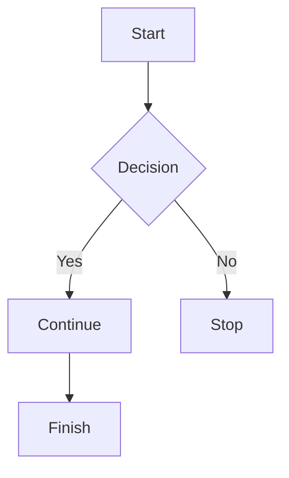
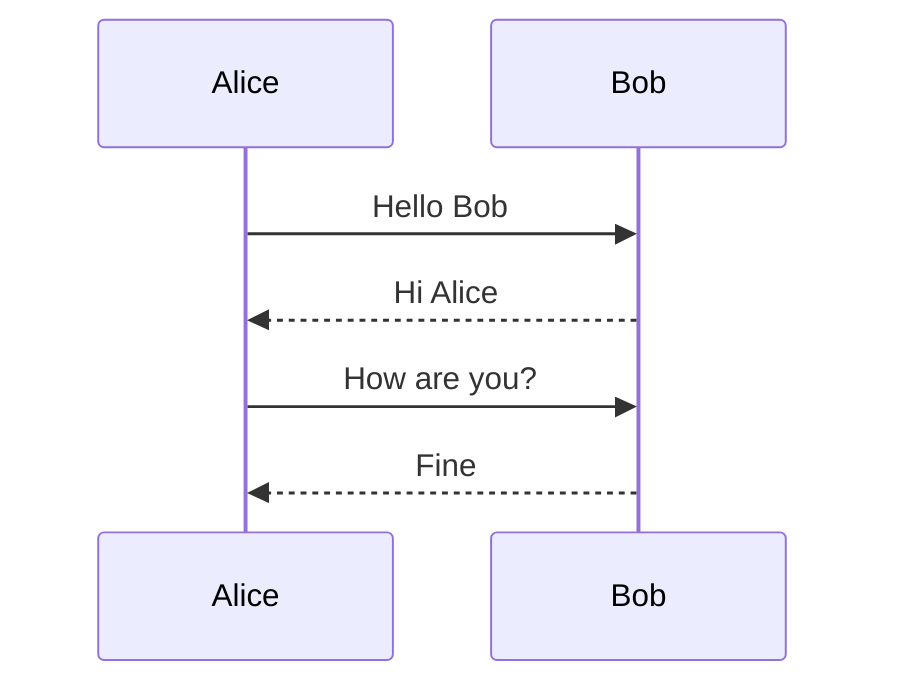
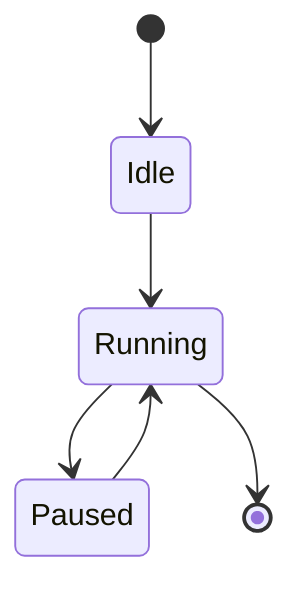

# Markdown Test Suite

This document is used to test the Markdown renderer.

---

## Heading Levels

# H1 Heading

## H2 Heading

### H3 Heading

#### H4 Heading

##### H5 Heading

###### H6 Heading

---

## Paragraphs

This is a normal paragraph.

This is the second paragraph.

This line is written
across multiple lines
in the Markdown source.

This is a very long paragraph to test the renderer's text wrapping capability. Lorem ipsum dolor sit amet, consectetur adipiscing elit, sed do eiusmod tempor incididunt ut labore et dolore magna aliqua.

---

## Inline Formatting

**Bold Text**

_Italic Text_

**_Bold + Italic_**

~~Strikethrough~~

`inline code`

**Bold with `inline code` inside**

Link: [Rust Language](https://www.rust-lang.org)

Another link: [GitHub](https://github.com)

---

## Lists

### Unordered

- Item A
- Item B
- Item C

### Nested Unordered

- Parent
  - Child 1
  - Child 2
    - Grandchild

### Ordered

1. First
2. Second
3. Third

### Nested Ordered

1. Main Item
   1. Sub Item
   2. Sub Item
2. Another Item

### Task List

- [ ] Todo item
- [x] Completed item
- [ ] Another todo

---

## Blockquote

> This is a quote.
>
> Multiple lines are included.
>
> — Someone

### Nested Quote

> Outer quote
>
> > Inner quote
>
> Back to outer quote

---

## Horizontal Rule

---

Content above.

---

Content below.

---

## Tables

| Name  | Age | City     |
| ----- | --- | -------- |
| Alice | 25  | London   |
| Bob   | 31  | New York |
| Carol | 22  | Tokyo    |

### Wide Table

| ID  | Name  | Description | Status  | Score |
| --- | ----- | ----------- | ------- | ----- |
| 1   | Alpha | First item  | Active  | 95    |
| 2   | Beta  | Second item | Pending | 81    |
| 3   | Gamma | Third item  | Closed  | 74    |

---

## Code Blocks

### Rust

```rust
fn main() {
    let answer = 42;

    println!("Answer = {}", answer);
}
```

### Python

```python
def fibonacci(n):
    if n <= 1:
        return n

    return fibonacci(n - 1) + fibonacci(n - 2)
```

### Bash

```bash
#!/usr/bin/env bash

echo "Hello world"

ls -la
```

### JSON

```json
{
  "name": "test",
  "enabled": true,
  "items": [1, 2, 3]
}
```

### Plain Text

```
This block has no language.
```

---

## Mermaid Flowchart



---

## Mermaid Sequence Diagram



---

## Mermaid State Diagram



---

## Images


---

## Escaping

_Not italic_

# Not heading

`Not code`

---

## Mixed Content

### Example Section

This paragraph contains **bold**, _italic_, ~~strikethrough~~ and `inline code`.

- Item 1
- Item 2
- Item 3

| Feature | Support |
| ------- | ------- |
| Heading | Yes     |
| Table   | Yes     |
| Mermaid | Yes     |

```rust
pub struct Example {
    pub value: String,
}
```

> Important note:
>
> Renderer should preserve formatting.

---

## Unicode Test

Vietnamese with diacritics.

Japanese test.

Korean test.

Chinese test.

😀 😎 🚀 🎉

---

## Long Paragraph Stress Test

Lorem ipsum dolor sit amet, consectetur adipiscing elit, sed do eiusmod tempor incididunt ut labore et dolore magna aliqua. Ut enim ad minim veniam, quis nostrud exercitation ullamco laboris nisi ut aliquip ex ea commodo consequat. Duis aute irure dolor in reprehenderit in voluptate velit esse cillum dolore eu fugiat nulla pariatur.

---

## End

Markdown test completed successfully.
